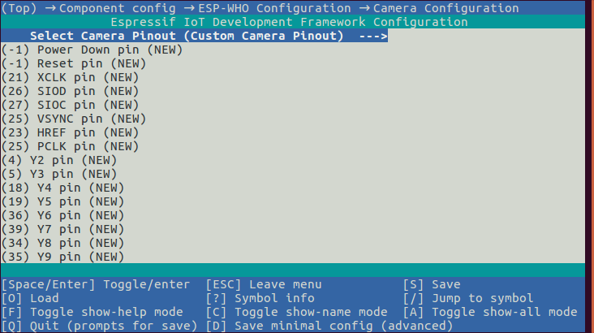
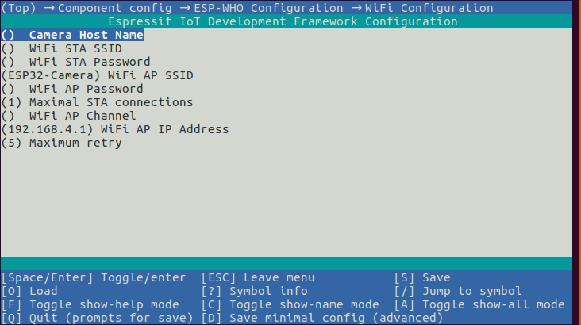

# M5 CoreS3 ESP-WHO demo

```shell
cd ~
mkdir esp && cd esp
git clone --recursive https://github.com/espressif/esp-idf.git
cd esp-idf; git checkout release/v4.4; git submodule init; git submodule update --init --recursive;
./install.sh
cd ..
git clone --recursive https://github.com/IcingTomato/M5CoreS3-ESP-WHO.git
cd M5CoreS3-ESP-WHO/examples/human_face_detection/lcd/
export ESPPORT=/dev/ttyACM0 (or /dev/cu.SLAB_USBtoUART on macOS or COMxx on MinGW)
export IDF_PATH=/path/to/esp-idf
. $IDF_PATH/export.sh
idf.py flash
```

# ESP-WHO [[English]](./README.md)

ESP-WHO 是基于乐鑫芯片的图像处理开发平台，其中包含了实际应用中可能出现的开发示例。

## 概述

ESP-WHO 提供了例如人脸检测、人脸识别、猫脸检测和手势识别等示例。您可以基于这些示例，衍生出丰富的实际应用。ESP-WHO 的运行基于 ESP-IDF。[ESP-DL](https://github.com/espressif/esp-dl) 为 ESP-WHO 提供了丰富的深度学习相关接口，配合各种外设可以实现许多有趣的应用。

<p align="center">
     
</p>


## 准备工作

### 硬件准备

我们推荐新手开发者使用乐鑫设计的开发板。ESP-WHO 提供的示例基于以下乐鑫开发板开发，开发板与芯片的对应关系如下表所示。
    
|    芯片    | [ESP32](https://www.espressif.com/zh-hans/products/socs/esp32) | [ESP32-S2](https://www.espressif.com/zh-hans/products/socs/esp32-s2) | [ESP32-S3](https://www.espressif.com/zh-hans/products/socs/esp32-s3) |
| :------- | :----------------------------------------------------------: | :----------------------------------------------------------: | :----------------------------------------------------------: |
| 开发板 | [ESP-EYE](https://www.espressif.com/zh-hans/products/devkits/esp-eye/overview) | [ESP32-S2-Kaluga-1](https://docs.espressif.com/projects/esp-idf/zh_CN/latest/esp32s2/hw-reference/esp32s2/user-guide-esp32-s2-kaluga-1-kit.html) | [ESP-S3-EYE](https://www.espressif.com/zh-hans/products/devkits/esp-s3-eye/overview) |

> 使用上表中未提及的开发板，需要手动修改外设的管脚配置，例如摄像头、LCD 和按键等。

### 软件准备

#### 获取 ESP-IDF

ESP-WHO 的运行基于 ESP-IDF。关于获取 ESP-IDF 的细节，请参考 [ESP-IDF 编程指南](https://idf.espressif.com/)。

> 请使用 ESP-IDF 在 [release/v4.4](https://github.com/espressif/esp-idf/tree/release/v4.4) 分支上的最新版本。

#### 获取 ESP-WHO

在终端运行以下命令，下载 ESP-WHO：

```bash
git clone --recursive https://github.com/espressif/esp-who.git
```

> 请记得使用 ``git submodule update --recursive --init`` 拉取和更新 ESP-WHO 的所有子模块。

## 运行示例

ESP-WHO 的所有示例都存放在 [examples](./examples) 中。该文件夹架构如下所示：

```bash
├── examples
│   ├── cat_face_detection          // 猫脸检测示例
│   │   ├── lcd                     // 结果显示方式为 LCD 屏
│   │   └── terminal                // 结果显示方式为终端
│   ├── code_recognition            // 一维码/二维码识别示例
│   ├── human_face_detection        // 人脸检测示例
│   │   ├── lcd
│   │   └── terminal
│   ├── human_face_recognition      // 人脸识别示例
│   │   ├── lcd
│   │   ├── terminal
│   │   └── README.md               // 示例的具体说明
│   └── motion_detection            // 移动侦测示例
│       ├── lcd 
│       ├── terminal
│       ├── web
│       └── README.rst              
```

对于[硬件准备](#硬件准备)中所提到的开发板，所有示例都是开箱即用的，要运行示例仅需执行[步骤 1：设定目标芯片](#步骤-1设定目标芯片)和[步骤 4：运行和监视](#步骤-4运行和监视)。

### 步骤 1：设定目标芯片

打开终端，进入一个示例（例如：examples/human_face_detection/lcd），运行以下命令设定目标芯片：

```bash
idf.py set-target [SoC]
```

将 [SoC] 替换成您的目标芯片，例如 esp32、esp32s2、esp32s3。

**注意：** 所有关于 `esp32s3` 的示例都是基于 ESP32-S3-EYE 开发的。所以默认的烧写和监听都设定为通过 USB。如果你正在使用 `esp32s3` 的其他开发板，请先确认是通过 USB 还是 UART 实现烧写和监听，

- 如果通过 USB，保持默认配置即可，
- 如果通过 UART，需要在 menuconfig 中修改烧写监听方法。

### （可选）步骤 2：摄像头配置

若您使用的不是[硬件准备](#硬件准备)中提到的乐鑫开发板，则需自行配置摄像头管脚。在终端输入 `idf.py menuconfig`，依次点击 (Top) -> Component config -> ESP-WHO Configuration 可进入 ESP-WHO 的配置界面，如下图所示：


选择 Camera Configuration 进入摄像头配置，根据您使用的开发板选择摄像头的管脚配置，如下图所示：


如上图中没有您使用的开发板，请选择 ``Custom Camera Pinout``，并正确配置对应管脚，如下图所示：



### （可选）步骤 3：Wi-Fi 配置

若您选择的示例输出显示方式为网页，可选择 Wi-Fi Configuration 进入 Wi-Fi 配置，配置 Wi-Fi 密码等参数，如下图所示：



### 步骤 4：运行和监视

烧录程序，运行 IDF 监视器：

```bash
idf.py flash monitor
```


## 开发板的默认二进制文件

各开发板的默认二进制文件存放在文件夹 [default_bin](./default_bin) 中。您可使用[烧写工具](https://www.espressif.com/zh-hans/support/download/other-tools)烧录二进制文件。


## 反馈

如果在使用中发现任何问题，请提交相关 [issue](https://github.com/espressif/esp-who/issues)，我们将尽快予以答复。
